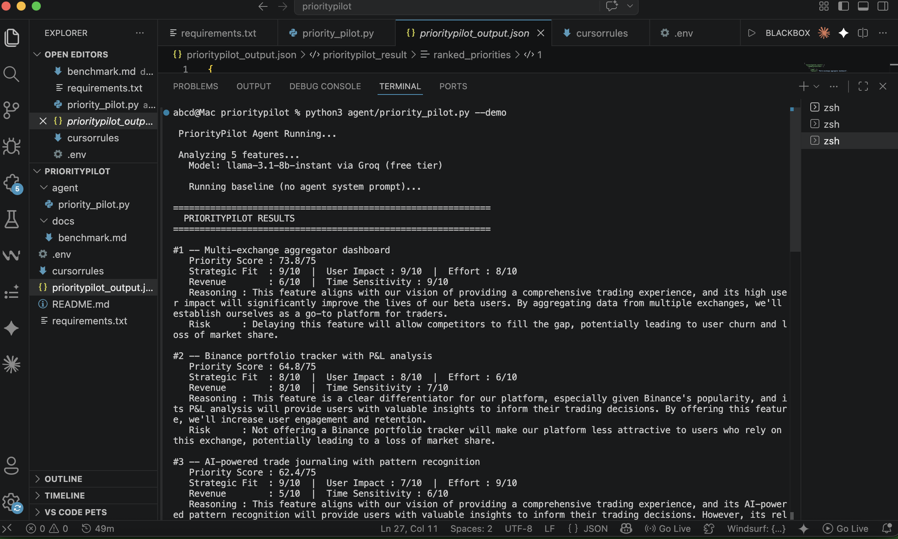

# 🎯 PriorityPilot

> An AI-Powered Product Prioritization Agent for APOs who can't afford to guess.

---

## Why I Built This

Most AI tools answer the question: *"What should I build?"*

That's the wrong question.

The right question is: *"What should I build **first**, and what happens if I don't?"*

That distinction is the difference between a product team that ships and one that drifts.

PriorityPilot is a specialized AI agent that forces disciplined, multi-dimensional thinking onto every prioritization decision — the same way a senior APO would, but faster and with consistent scoring logic every time.

---

## Why This Problem Was My #1 Priority

In an AI-first world where MVPs take 2 days instead of 3 months, the bottleneck has shifted.

The bottleneck is no longer **"can we build it?"**

It's **"should we build this or that, and why?"**

Every team I've seen struggle with AI tooling doesn't struggle with the tools themselves — they struggle with **what to point the tools at**. They build the wrong thing at high speed.

PriorityPilot solves the prioritization layer — the layer above execution.

Without it, AI-accelerated teams become AI-accelerated **drift**.

---

## What It Does

Given a list of product features or ideas, PriorityPilot:

1. **Scores each feature** across 5 strategic dimensions
2. **Computes a priority score** (out of 75) using a weighted formula
3. **Provides sharp reasoning** — 2 sentences per feature plus a risk-if-deprioritized statement
4. **Returns structured JSON** — machine-readable and pipeable into other tools
5. **Benchmarks against a baseline LLM response** — to show exactly what the agent adds
6. **Improves JSON reliability** — automatically cleans and extracts structured data even when the model deviates

---

## Scoring System

### 5-Dimensional Framework

| Dimension | Weight | What It Measures |
|-----------|--------|-----------------|
| Strategic Fit | 2× | Alignment with company vision and stated priorities |
| User Impact | 2× | Breadth and depth of user experience change |
| Effort Estimate | 1× | Inverse of build complexity (10 = ships in a day) |
| Revenue Leverage | 1.5× | Unlock of new revenue, retention, or growth loops |
| Time Sensitivity | 1× | Cost of delay — competition, market window, trust |

### Formula

```
Priority Score = (Strategic Fit × 2) + (User Impact × 2) + Effort + (Revenue × 1.5) + Time Sensitivity
Maximum = 75
```

### Performance Score (1 to 10,000)

The agent's own quality is measured on a 10,000-point scale:

| Dimension | Max Points | What's Measured |
|-----------|-----------|-----------------|
| Structured Output Quality | 2,500 | Valid JSON with all required fields |
| Reasoning Depth | 2,500 | Per-item reasoning + risk statements |
| Dimensional Coverage | 2,000 | All 5 axes scored for every feature |
| Actionability | 2,000 | Clear top-priority next action |
| Speed Efficiency | 1,000 | Response time under 10 seconds |

**PriorityPilot (typical demo run): ~8,500–9,700 / 10,000 (Grade: A–S)**  
**Baseline LLM (demo run): ~1,000–2,000 / 10,000 (Grade: C)**

See full benchmark in [`docs/benchmark.md`](docs/benchmark.md)

---

## Quick Start

### 1. Clone and Install

```bash
git clone https://github.com/YOUR_USERNAME/prioritypilot
cd prioritypilot
pip install -r requirements.txt
```

### 2. Set Your API Key

```bash
cp .env.example .env
# Edit .env and add your Groq API key
GROQ_API_KEY=gsk_your_key_here
```

### 3. Run Demo

```bash
python agent/priority_pilot.py --demo
```

### 4. Run with Your Own Features

```bash
python agent/priority_pilot.py \
  --context "Early-stage fintech app, 1000 users" \
  --features \
    "Binance portfolio tracker" \
    "AI trade journaling" \
    "Telegram price alerts" \
    "Social trading feed"
```

### 5. Interactive Mode

```bash
python agent/priority_pilot.py
# Follow prompts to enter context and features
```

---

## Cursor Integration

This project is fully Cursor-ready.

The `.cursorrules` file configures Cursor to:
- Understand the agent's scoring architecture
- Maintain consistency when editing the system prompt
- Enforce security rules (no hardcoded keys)
- Guide AI suggestions to match the project's code style

To use in Cursor:
1. Open the project folder in Cursor
2. `.cursorrules` is auto-detected
3. Cursor will suggest edits aligned with the agent's design principles

---

## Example Output



```
============================================================
  🎯 PRIORITYPILOT RESULTS
============================================================

#1 — Binance portfolio tracker with P&L analysis
   Priority Score: 70.0/75
   Strategic Fit: 10/10 | User Impact: 9/10 | Effort: 6/10
   Revenue: 8/10 | Time Sensitivity: 9/10
   💡 Binance integration is the company's stated #1 priority, making this
      directly aligned with executive mandate. P&L visibility is the
      single most-requested feature among early trading app users.
   ⚠️  Risk: Users cannot assess performance and will churn to competitors
      like CoinStats or Delta within 30 days.

#2 — Telegram bot for price alerts
   Priority Score: 61.0/75
   ...

📋 SUMMARY: The top two priorities form a retention stack — ship these
   before any social or multi-exchange features.

⚡ TOP ACTION: Start Binance API integration this sprint — it unblocks
   both the portfolio tracker and future aggregator work.
```

---

## Project Structure

```
prioritypilot/
├── agent/
│   └── priority_pilot.py      # Core agent logic
├── docs/
│   └── benchmark.md           # PriorityPilot vs baseline comparison
├── .cursorrules               # Cursor AI configuration
├── .env.example               # Environment variable template
├── .gitignore                 # Excludes .env and secrets
├── requirements.txt           # Python dependencies
└── README.md                  # This file
```

---

## Security

- All API keys are loaded from environment variables via `.env`
- `.env` is in `.gitignore` and will never be committed
- `.env.example` is the only committed reference to env vars
- No secrets appear anywhere in the codebase

---

## Design Decisions

**Why Groq + LLaMA?**  
Groq provides extremely fast inference, making PriorityPilot feel near real-time.  
While LLaMA models are less strict with JSON than Claude, the agent includes
post-processing (`clean_json`) to recover valid structured outputs in most cases.

**Why 5 dimensions?**  
Classic prioritization frameworks (RICE, ICE, MoSCoW) collapse too many variables into too few buckets. Five dimensions captures the real tradeoffs without becoming unwieldy.

**Why JSON output?**  
An APO tool that returns prose is a dead end. JSON makes the output pipeable — it can feed into dashboards, Notion databases, Slack bots, or other agents.

**Why compare against a baseline LLM?**  
A custom agent that doesn't provably outperform a default model response is not an agent — it's just a prompt. The benchmark section exists to prove the value of specialization.

---

## The Philosophy

> *Don't compete with a shovel against an excavator in a digging battle.*

Priority definition is the highest-leverage skill in an AI-first organization.  
When everything can be built in 2 days, *what* you build is everything.  
PriorityPilot is the excavator for that decision.

---

## Author

Built as a quest submission for an AI-native APO role.  
Questions or feedback: open an issue.
